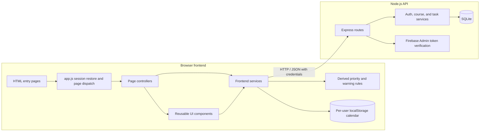
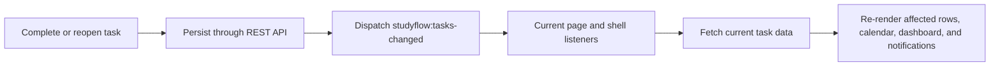

<div align="center">
  

  <p><strong>Know what to study next—and turn priorities into a study plan.</strong></p>

  <p>
    A rule-based study planner that brings course management, task prioritization,<br>
    workload awareness, progress tracking, and calendar scheduling into one workflow.
  </p>

  <p>
    
    
    
    
  </p>
  <p>
    
    
    
    
    
  </p>

  <p>
    <strong><a href="https://usth-b3-projects.github.io/Student-Studies-Web/">Live Demo</a></strong>
    · <a href="#project-documents">Documentation</a>
    · <a href="docs/refactor-report.md">Refactor Report</a>
  </p>
</div>

---

## Why Student Studies?

Traditional task managers mainly answer: **“What tasks do I have?”** Student Studies also helps answer: **“Which task should I focus on next?”**

```text
Course management
    -> Task management
    -> Priority calculation
    -> Recommendation and warnings
    -> Calendar scheduling
    -> Progress tracking
```

The recommendation is rule-based, not AI-generated. It is calculated from each task's deadline, importance, estimated duration, and current progress, so the result remains explainable.

## Key Features

### Course management

- Create, rename, color-code, view, and delete courses.
- See task counts, completion totals, and average progress for each course.
- Search and filter courses by derived status, sort by name or progress, switch between grid and list views, and paginate the results.
- Deleting a course removes its tasks in the same SQLite transaction.

### Task management

- Create and edit tasks with a name, description, exact deadline, five-level importance, optional estimated duration, and progress.
- Track progress at `0`, `25`, `50`, `75`, or `100` percent.
- Search, filter, sort, paginate, complete, reopen, and delete tasks.
- Complete or delete multiple selected tasks; completion supports an undo action.
- Reorder visible task rows by dragging. This manual order lasts only for the current page session.

### Smart prioritization and Recommended Next

- Calculate urgency, importance, remaining workload, workload, and a combined priority score at runtime.
- Exclude completed tasks, then rank the rest by score with deterministic tie-breaking.
- Show the first ranked incomplete task as **Recommended next** on each course page.
- Recalculate recommendations when task data is fetched again; a manual row order can temporarily override the displayed recommendation.

### Dashboard, progress, and warnings

- Summarize pending, overdue, due-today, and completed tasks.
- Show today's completion percentage, upcoming deadlines, priority, and task progress.
- Surface overdue tasks and workload warnings in the dashboard and notification menu.
- Derive task status and warning data instead of storing duplicated values in the database.

### Calendar and study sessions

- Switch between day, week, and month views and navigate to previous, next, or current dates.
- Search active tasks and filter them by scheduled state.
- Drag an eligible task onto a day/week timeline to create a study session.
- Move existing sessions on the timeline or between dates in the month view.
- Inspect, edit, or remove a session; timeline drops snap to 30-minute positions.
- Warn before saving a session that extends beyond its task deadline.

### Authentication and profile

- Register and sign in with a local username/password account.
- Sign in with Google through Firebase Authentication and server-side Firebase ID-token verification.
- Restore a backend session from an HTTP-only cookie, log out, and edit the current display name or email.
- Store courses and tasks per authenticated student.

### Interface

- Responsive layouts are defined for desktop, tablet, and smaller screens.
- Light and dark themes are stored in the browser.
- Dialogs, notifications, keyboard interactions, reduced-motion handling, and accessible labels are included throughout the interface.

## Smart Prioritization

The browser UI derives smart values in `FE/services/smartService.js`. The underlying task record remains limited to user-entered and lifecycle data; scores, status, remaining workload, and warnings are not stored.

### Inputs and derived values

| Kind | Values |
| --- | --- |
| Stored task data | Deadline, importance, estimated duration, current progress, creation time |
| Derived values | Urgency score, importance score, remaining workload, workload score, priority score, display status, warning state |
| Recommendation output | Ranked incomplete tasks; the first item is Recommended Next for a course |

If estimated duration is omitted, priority calculations use a two-hour fallback without changing the stored `null` value.

```text
remaining workload = effective duration * (1 - current progress / 100)

priority score = 0.60 * urgency
               + 0.25 * importance
               + 0.15 * workload
```

### Score mappings

| Deadline state | Urgency |
| --- | ---: |
| More than 7 calendar days away | 20 |
| 4–7 days away | 40 |
| 2–3 days away | 60 |
| Tomorrow | 80 |
| Later today | 90 |
| Past the exact deadline | 100 |

| Importance | Score |
| --- | ---: |
| Very low | 20 |
| Low | 40 |
| Medium | 60 |
| High | 80 |
| Very high | 100 |

| Remaining workload | Workload score |
| --- | ---: |
| Up to 1 hour | 20 |
| More than 1 and up to 2 hours | 40 |
| More than 2 and up to 4 hours | 60 |
| More than 4 and up to 6 hours | 80 |
| More than 6 hours | 100 |

Incomplete tasks are ordered by:

1. Priority score, descending.
2. Deadline, ascending.
3. Importance score, descending.
4. Creation time, ascending.

The frontend rounds the displayed score to one decimal place. A task at `100%` is excluded from ranking. Overdue tasks remain eligible and receive the maximum urgency score.

### Recommendations and warnings

The course page selects the first incomplete task in its current ranked/manual order as **Recommended next**. Updating task data and re-rendering the page recalculates all derived values.

An incomplete task receives a workload warning only when it has an explicit estimated duration and either condition is true:

```text
(urgency >= 80 and workload >= 60)
or
(urgency >= 60 and workload >= 80)
```

Overdue tasks are shown separately as overdue notifications. Completed tasks produce neither warning type.

The authenticated `GET /api/v1/smart` endpoint exposes a second server-side ranking implementation. It uses the same weights and tie-break order, but its urgency buckets use rolling 24-hour differences rather than the browser's calendar-day comparison. Current pages calculate their displayed rankings in the browser instead of calling this endpoint.

## Architecture



The application is a multi-page static frontend backed by a REST API. It does not use a frontend framework or build step. Express route modules act as the HTTP/controller boundary; backend service modules perform validation, ownership checks, business operations, and SQL calls.

## Frontend Architecture

| Layer | Location | Responsibility |
| --- | --- | --- |
| Entry and dispatch | `FE/app.js`, `FE/pages/*.html` | Restore the session, identify the current page, and run its initializer |
| Page controllers | `FE/pages/*.js` | Load data, coordinate user actions, and render page-specific UI |
| Components | `FE/components/` | Shared modals, task rows, scheduling controls, shell, notifications, and UI helpers |
| Services | `FE/services/` | API access, auth state, course/task operations, smart calculations, and calendar persistence |
| Utilities | `FE/utils/` | Calendar date/time calculations and positioning |
| Styling and assets | `FE/css/`, `FE/assets/` | Responsive layouts, themes, transitions, and images |

`apiClient.js` centralizes JSON requests, cookie credentials, and API error conversion. Page modules keep DOM coordination separate from the service functions that fetch or derive data.

## Backend Architecture

| Layer | Location | Responsibility |
| --- | --- | --- |
| Application setup | `BE/app.js` | CORS, JSON parsing, request-shape checks, route mounts, health check, and JSON error responses |
| Routes | `BE/routes/` | HTTP methods, authentication middleware, status codes, and response shapes |
| Services | `BE/services/` | Validation, ownership checks, authentication, CRUD, completion history, and smart ranking |
| Middleware | `BE/middleware/authenticate.js` | Session creation, cookie parsing, expiry checks, and logout cleanup |
| Database | `BE/models/database.js` | SQLite connection, schema creation, indexes, and legacy migrations |

The backend validates course names and colors, task deadlines and allowed values, profile data, request-body shape, and resource ownership. Service errors carry HTTP status codes; the final Express error middleware returns JSON without exposing internal server errors.

## Authentication

### Local authentication

```text
Register -> validate fields -> create Student in SQLite
         -> login -> create random session token
         -> store SHA-256 token hash in SQLite
         -> set HTTP-only session cookie
```

Sessions expire after seven days. Development cookies use `SameSite=Lax`; with `NODE_ENV=production`, cookies use `Secure` and `SameSite=None`. Protected course, task, profile, and smart routes resolve the cookie to an unexpired database session.

Local registration enforces a unique username, a non-empty display name, matching passwords, and a minimum password length of eight characters. The current prototype stores local passwords as plain text and exposes username-based password reset without ownership verification.

### Google authentication

```text
Firebase browser popup -> Firebase ID token -> POST /auth/google
                       -> Firebase Admin verifies token
                       -> find or create Student
                       -> create the same backend cookie session
```

The backend links Google users by Firebase UID. A verified email may be used as the initial username, with a UID suffix added if that username is already taken. Google sign-in requires Firebase Admin credentials for the configured project in the backend environment.

## Calendar & Drag and Drop

Calendar sessions are browser-side records shaped as:

```json
{
  "sessionId": "generated UUID",
  "taskId": "task ID",
  "startTime": "ISO 8601 date-time",
  "endTime": "ISO 8601 date-time"
}
```

They are stored under a username-specific `localStorage` key. Day and week views render a 24-hour timeline; month view renders six weeks and up to three visible sessions per day. New timeline drops snap to 30-minute positions. The initial duration is the task's calculated remaining workload; if no duration was entered, the app creates the fallback block and immediately opens the schedule editor.

Sessions can span midnight, are clipped into per-day display segments, and can be edited or deleted independently of the task. Completing a task does not delete its sessions; future sessions become inactive. The current calendar loads non-overdue tasks only, so overdue tasks and their sessions are not presented in the calendar UI.

## State Synchronization

Completion changes use the custom browser event `studyflow:tasks-changed`:



This updates the active page without forcing a full-page reload. The event is in-page only: it is not a WebSocket, cross-tab channel, or multi-user real-time system. Create, edit, and delete flows call their page render function directly rather than publishing this event.

## Data Model

| Entity | Persistence | Purpose and relationships |
| --- | --- | --- |
| Student | SQLite `students` | Account/profile record; owns courses through unique `username`; may be linked to a Firebase UID |
| AuthSession | SQLite `auth_sessions` | Hashed session token with expiry; belongs to one Student |
| Course | SQLite `courses` | Student-owned grouping with name and optional color; has many Tasks |
| Task | SQLite `tasks` | Course work with deadline, importance, duration, progress, completion history, and creation time |
| CalendarSession | Browser `localStorage` | Manual time block linked to a Task ID; scoped by username and browser profile |

SQLite foreign keys and service-level ownership queries keep courses and tasks scoped to the authenticated student. Priority scores, warning state, remaining workload, and display status are derived and are not database columns.

## Tech Stack

### Frontend

- Semantic HTML and responsive CSS.
- Vanilla JavaScript ES modules.
- Browser Fetch API, CustomEvent, Web Storage, HTML Drag and Drop, and View Transitions when supported.
- Firebase Web SDK 12.19.0 loaded from Google's CDN for Google sign-in.

### Backend

- Node.js with CommonJS modules.
- Express 5.2.1.
- `cors` and `dotenv`.
- Firebase Admin SDK 13.10.0 for ID-token verification.

### Database

- SQLite through `better-sqlite3` 12.4.1.
- Startup schema creation, indexes, foreign keys, and small compatibility migrations.

### Development and deployment

- `nodemon` for backend development.
- GitHub Actions and GitHub Pages for the static frontend.
- The non-local frontend API base points to the current Render deployment.

## Project Structure

```text
Student-Studies-Web/
├── .github/workflows/deploy.yml  # GitHub Pages deployment
├── BE/
│   ├── middleware/               # Cookie-session authentication
│   ├── models/                   # SQLite connection and schema
│   ├── routes/                   # REST route handlers
│   ├── services/                 # Business logic and validation
│   ├── app.js                    # Express application
│   ├── firebaseAdmin.js          # Firebase token verifier
│   ├── server.js                 # API process entry point
│   └── package.json
├── FE/
│   ├── assets/                   # Branding and UI images
│   ├── components/               # Shared UI behavior
│   ├── css/                      # Page, responsive, and theme styles
│   ├── pages/                    # HTML entries and page controllers
│   ├── services/                 # API, auth, smart, and calendar services
│   ├── utils/                    # Calendar calculations
│   ├── app.js                    # Frontend dispatcher
│   ├── config.js                 # Local/hosted API selection
│   └── firebase.js               # Firebase browser configuration
├── docs/                         # Design and refactor documentation
├── package.json                  # Root backend start/dev shortcuts
└── README.md
```

## Screenshots / Demo

Use the **[live demo](https://usth-b3-projects.github.io/Student-Studies-Web/)** to explore the current interface. The repository does not currently contain dedicated product screenshots or demo videos.

> TODO: add current captures of the Dashboard, course task list and Recommended Next panel, Calendar drag-and-drop flow, and authentication screen under `docs/screenshots/`.

Existing files in `docs/` include workflow, use-case, and class diagrams. Some describe earlier intended interfaces, so the current source code remains authoritative.

## Demo Flow

1. Register a local account or sign in with Google.
2. Create a course and choose its color.
3. Add tasks with deadlines, importance, estimated duration, and progress.
4. Open the course to compare priority scores and the Recommended Next task.
5. Search, filter, sort, or manually reorder the task list.
6. Update progress or mark a task complete, then observe the recommendation and warning UI refresh.
7. Open the Dashboard to review deadlines, attention items, and today's progress.
8. Open Calendar and drag an unscheduled task into a day/week time slot.
9. Move or edit the study session and inspect the deadline-conflict warning if it runs late.
10. Switch to month view to review the study plan across dates.

## Testing

The current repository does **not** include an automated test suite or an `npm test` script. Do not treat results recorded in older documentation as the status of the current tree.

The smallest available repository-wide check is JavaScript syntax validation:

```powershell
Get-ChildItem BE,FE -Recurse -Filter *.js |
  Where-Object FullName -NotMatch '[\\/]node_modules[\\/]' |
  ForEach-Object { node --check $_.FullName }
```

Manual verification should cover local and Google authentication, ownership boundaries, course/task CRUD, completion undo, recommendations, warnings, and calendar persistence.

## Getting Started

### Prerequisites

- Node.js `20`, `22`, or `24` and npm. These versions satisfy the current `better-sqlite3` engine declaration.
- A modern browser.
- A static HTTP server for the frontend. The examples below use Python's standard library.
- Firebase Admin credentials only if testing Google sign-in locally.

### Installation

```bash
git clone https://github.com/USTH-B3-Projects/Student-Studies-Web.git
cd Student-Studies-Web
npm ci --prefix BE
```

The frontend has no build step and imports the Firebase browser modules from the CDN.

### Environment variables

| Variable | Required | Default / effect |
| --- | --- | --- |
| `PORT` | No | API port; defaults to `5000` |
| `STUDYFLOW_DB_PATH` | No | SQLite file path; defaults to `BE/data.db` |
| `NODE_ENV` | No | `production` enables `Secure; SameSite=None` on the session cookie |
| `FIREBASE_PROJECT_ID` | Google auth only | Defaults to `studyflow-68540` |

The Firebase Admin SDK must also be able to obtain credentials for the selected project when Google authentication is used. Local username/password authentication does not require Firebase credentials.

### Database setup

No migration command is required. Starting the API opens the configured SQLite file, creates missing tables and indexes, and runs the included compatibility migrations. The repository currently contains a versioned `BE/data.db`; set `STUDYFLOW_DB_PATH` if you want to work against a separate local database.

### Running the backend

From the repository root:

```bash
npm start
```

For automatic restart during backend development:

```bash
npm run dev
```

The default health endpoint is <http://localhost:5000/api/v1/health>.

### Running the frontend

In a second terminal, from the repository root:

```bash
python -m http.server 5501 --directory FE
```

Open <http://localhost:5501/pages/index.html>. Local frontend configuration expects the API at port `5000`; ports `5500` and `5501` are included in the backend CORS allowlist.

## API Overview

All endpoints are under `/api/v1`. Protected endpoints use the `studyflow_session` cookie.

| Method | Endpoint | Authentication | Purpose |
| --- | --- | --- | --- |
| `GET` | `/health` | No | API health check |
| `POST` | `/auth/register` | No | Create a local student account |
| `POST` | `/auth/login` | No | Authenticate locally and create a session |
| `POST` | `/auth/reset` | No | Replace a local password by username |
| `POST` | `/auth/google` | No | Verify a Firebase ID token and create a session |
| `GET` | `/auth/me` | Yes | Return the current student profile |
| `PATCH` | `/auth/me` | Yes | Update display name and email |
| `POST` | `/auth/logout` | No | Delete the current session and clear its cookie |
| `GET`, `POST` | `/courses` | Yes | List or create courses |
| `GET`, `PUT`, `DELETE` | `/courses/:id` | Yes | Read, update, or delete an owned course |
| `GET`, `POST` | `/tasks` | Yes | List tasks, optionally by `courseId`, or create a task |
| `GET`, `PUT`, `DELETE` | `/tasks/:id` | Yes | Read, update, or delete an owned task |
| `PATCH` | `/tasks/:id/completion` | Yes | Complete or reopen a task |
| `GET` | `/smart` | Yes | Return ranked recommendations, optionally by `courseId` |

## Future Improvements

- Hash local passwords and replace username-only reset with a verified recovery flow.
- Consolidate browser and API priority rules into one authoritative implementation.
- Persist calendar sessions and manual ordering through authenticated API endpoints.
- Add automated unit, API integration, and browser interaction tests to CI.
- Add touch-friendly calendar scheduling and cross-device synchronization.
- Move to a managed database and explicit migration tooling if deployment requirements outgrow SQLite.
- Add versioned API documentation and current product screenshots.

## Team

| No. | Full name | Student ID |
| ---: | --- | ---: |
| 1 | Nguyễn Minh Nhật | 2410757 |
| 2 | Hoàng Thu An | 2410002 |
| 3 | Hoàng Ngân Anh | 2410030 |
| 4 | Trần Mai Anh | 2410093 |
| 5 | Vũ Đức Quang | 2410831 |
| 6 | Đoàn Quốc Việt | 2411057 |

## Project Documents

- [Project brief](docs/studyflow-brief.md)
- [Data contract](docs/data-contract.md)
- [Module interface notes](docs/module-interface.md)
- [Repository context](docs/CONTEXT.md)
- [Workflow diagram](docs/WorkFlow.drawio.png)
- [Use-case diagram](docs/UseCaseDiagram.png)
- [Class diagram](docs/ClassDiagram.drawio.png)
- [Refactor audit](docs/refactor-audit.md)
- [Refactor report](docs/refactor-report.md)

These documents provide useful project history, but some predate the current implementation. When they conflict with source code, the source code is authoritative.
